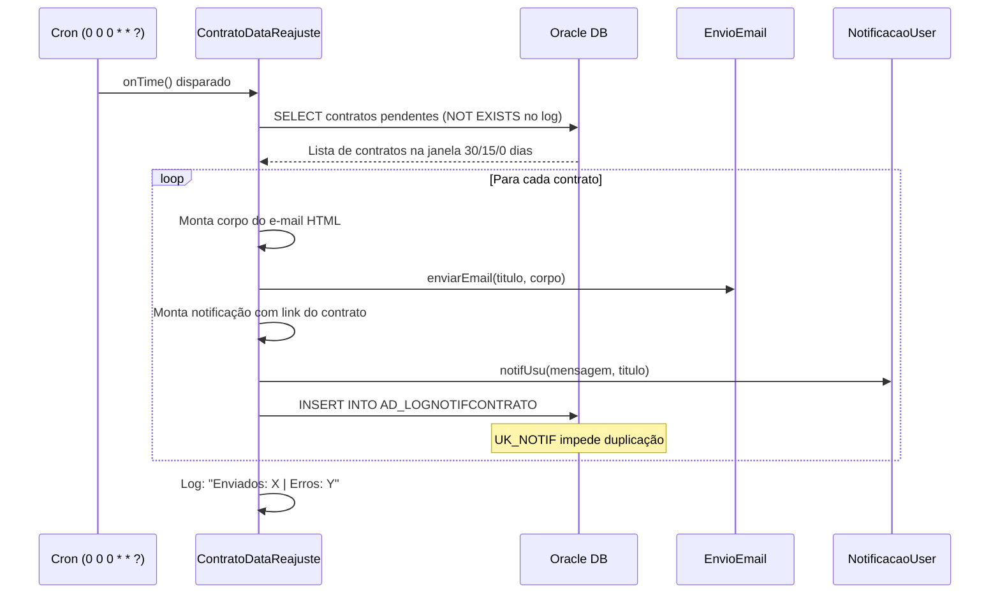
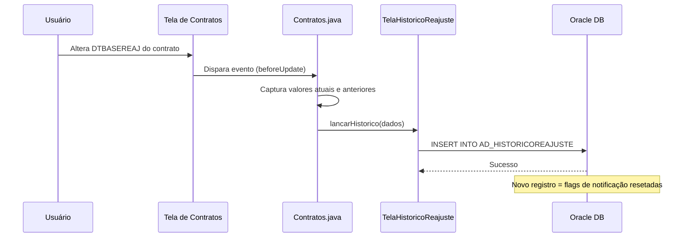
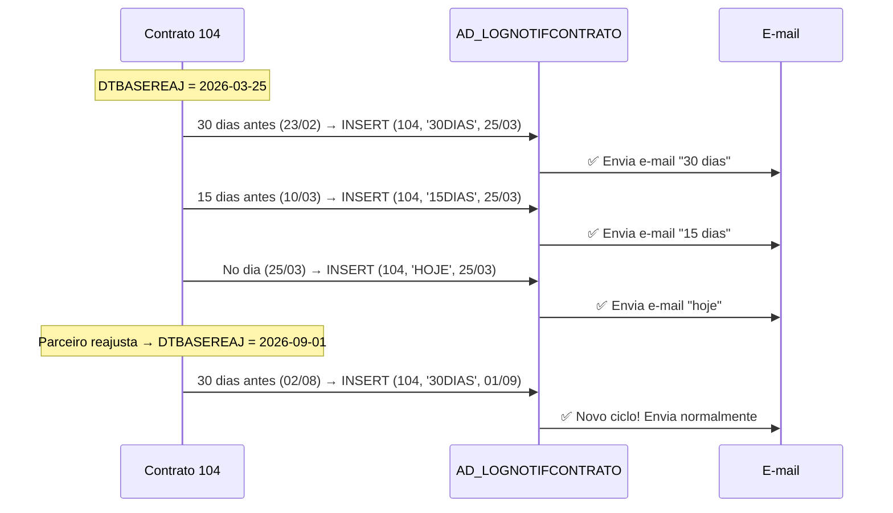

# 📦 AG-CONTRATOS — Avisos de Reajuste de Contrato


> Extensão Java para o ERP Sankhya — evento programado para envio automático de notificações (e-mail + notificação interna) nos marcos de 30, 15 e 0 dias antes do vencimento da data base de reajuste de contratos.

---

## 📋 Sobre o Projeto

Este projeto é uma customização Sankhya composta por:

- **Evento Programado (ScheduledAction):** Executa diariamente via cron, identificando contratos cuja `DTBASEREAJ` está a 30, 15 ou 0 dias de vencer. Envia e-mail ao contato do parceiro e notificação interna aos usuários do sistema.
- **Controle de Envio Único:** Utiliza a tabela `AD_LOGNOTIFCONTRATO` com constraint UNIQUE `(NUMCONTRATO, TIPONOTIF, DTBASEREAJ)` para garantir que cada notificação seja enviada **uma única vez** por contrato/tipo/ciclo de reajuste.
- **Histórico de Reajuste:** Registra automaticamente cada alteração de data base de reajuste na tabela `AD_HISTORICOREAJUSTE`, mantendo rastreabilidade completa de valores anteriores e atuais.

---

## 🛠 Estrutura do Projeto

```
br.com.argo.contratos
├── ContratoDataReajuste.java     # Evento Programado (ScheduledAction) — envio de notificações
├── EnvioEmail.java               # Serviço de envio de e-mail via Sankhya
├── NotificacaoUser.java          # Serviço de notificação interna do Sankhya
├── Contratos.java                # Evento Programável — captura alterações de reajuste
├── DataReajuste.java             # Lógica de validação de data de reajuste
├── TelaHistoricoReajuste.java    # Persistência do histórico de reajuste (AD_HISTORICOREAJUSTE)
└── Util.java                     # Utilitários gerais
```

---

## 📖 Detalhes das Classes

### `ContratoDataReajuste.java`

Implementa `ScheduledAction` e é executada via cron (evento programado).

**Responsabilidades:**

- Consulta contratos com `DTBASEREAJ` a 30, 15 ou 0 dias do vencimento via query com `TRUNC(SYSDATE)`.
- Filtra contratos já notificados usando `NOT EXISTS` na tabela `AD_LOGNOTIFCONTRATO`.
- Monta e envia e-mail HTML personalizado com dados do contrato (parceiro, datas, número do contrato).
- Envia notificação interna com link direto para o contrato no Sankhya (via Base64).
- Registra o envio na tabela de log via `PreparedStatement` com sessão JDBC separada.
- Trata erros individualmente por contrato — se um falhar, os demais continuam.
- Exibe resumo ao final: total de envios bem-sucedidos e total de erros.

### `Contratos.java`

Evento Programável que intercepta alterações na tela de contratos.

**Responsabilidades:**

- Captura dados do contrato quando há alteração na data base de reajuste.
- Delega a gravação do histórico para `TelaHistoricoReajuste`.

### `TelaHistoricoReajuste.java`

Camada de persistência do histórico de reajustes.

**Responsabilidades:**

- Insere registro na tabela `AD_HISTORICOREAJUSTE` via `JapeWrapper.create().set(...).save()`.
- Armazena valores anteriores e atuais: `DTBASEREAJ`, `DTBASEREAJANT`, `FREQREAJ`, `FREQREAJANTI`, `AD_VLRCONTRATO`, `AD_VLRCONTRATOHIST`.
- Registra usuário e data da alteração para auditoria.

### `EnvioEmail.java`

Serviço responsável pelo disparo de e-mails.

**Responsabilidades:**

- Envia e-mail via infraestrutura do Sankhya (remetente `noreply`).
- Recebe título e corpo HTML como parâmetros.

### `NotificacaoUser.java`

Serviço de notificação interna do Sankhya.

**Responsabilidades:**

- Envia notificação pop-up para usuários configurados no sistema.
- Exibe informações do contrato com link direto para a tela de contratos.

---

## 🗄 Requisitos de Banco de Dados (Oracle)

### Tabelas e Instâncias

| Tabela Banco            | Instância Java            | Descrição                              |
|-------------------------|---------------------------|----------------------------------------|
| `TCSCON`                | `Contrato`                | Cadastro de Contratos (origem)         |
| `TGFPAR`                | `Parceiro`                | Cadastro de Parceiros                  |
| `TGFCTT`                | `ContatoParceiro`         | Contatos do Parceiro (e-mail)          |
| `AD_LOGNOTIFCONTRATO`   | `AD_LOGNOTIFCONTRATO`     | Log de Notificações Enviadas           |
| `AD_HISTORICOREAJUSTE`  | `AD_HISTORICOREAJUSTE`    | Histórico de Reajustes de Contrato     |

### Campos da Tabela `AD_LOGNOTIFCONTRATO`

| Campo         | Tipo          | Descrição                                    |
|---------------|---------------|----------------------------------------------|
| `IDLOG`       | NUMBER (PK)   | ID sequencial (via `SEQ_LOGNOTIFCONTRATO`)   |
| `NUMCONTRATO` | NUMBER        | Número do Contrato                           |
| `TIPONOTIF`   | VARCHAR2(10)  | Tipo: `15DIAS`, `30DIAS` ou `HOJE`           |
| `DTBASEREAJ`  | DATE          | Data base de reajuste do contrato            |
| `DTENVIO`     | DATE          | Data/hora do envio (default `SYSDATE`)       |

**Constraints:**
- `PK`: `IDLOG`
- `UK_NOTIF`: `UNIQUE (NUMCONTRATO, TIPONOTIF, DTBASEREAJ)` — garante envio único

### Campos da Tabela `AD_HISTORICOREAJUSTE`

| Campo               | Tipo        | Descrição                          |
|---------------------|-------------|------------------------------------|
| `CODCONTRATO`       | NUMBER      | Código do Contrato                 |
| `FREQREAJ`          | NUMBER      | Frequência de reajuste (atual)     |
| `DTBASEREAJ`        | TIMESTAMP   | Data base reajuste (atual)         |
| `DTBASEREAJANT`     | TIMESTAMP   | Data base reajuste (anterior)      |
| `FREQREAJANTI`      | NUMBER      | Frequência de reajuste (anterior)  |
| `DTALTERACAO`       | TIMESTAMP   | Data/hora da alteração             |
| `NOMEUSER`          | VARCHAR2    | Nome do usuário que alterou        |
| `CODUSER`           | NUMBER      | Código do usuário                  |
| `AD_VLRCONTRATO`    | NUMBER      | Valor do contrato (atual)          |
| `AD_VLRCONTRATOHIST`| NUMBER      | Valor do contrato (anterior)       |

### Objetos de Banco Necessários

```sql
-- Constraint UNIQUE (criar após construtor de telas)
ALTER TABLE AD_LOGNOTIFCONTRATO
ADD CONSTRAINT UK_NOTIF UNIQUE (NUMCONTRATO, TIPONOTIF, DTBASEREAJ);

-- Sequence (criar manualmente — construtor de telas não cria)
CREATE SEQUENCE SEQ_LOGNOTIFCONTRATO START WITH 1 INCREMENT BY 1;
```

---

## 🔄 Fluxo de Funcionamento

### Fluxo 1: Envio de Notificações (Evento Programado)



### Fluxo 2: Registro de Histórico (Evento Programável)



### Fluxo 3: Ciclo de Vida de Notificações por Contrato



---

## 🚀 Guia de Implantação (Deploy)

### 1. Compilação

Gere o arquivo `.jar` do projeto:

```
AG-AVISOS-CONTRATOS.jar
```

### 2. Criação da Tabela de Log

Na tela **Construtor de Telas** do Sankhya, crie a tabela `AD_LOGNOTIFCONTRATO` com os campos listados acima (IDLOG, NUMCONTRATO, TIPONOTIF como Lista de Opções, DTBASEREAJ, DTENVIO).

Depois, execute manualmente no banco:

```sql
ALTER TABLE AD_LOGNOTIFCONTRATO
ADD CONSTRAINT UK_NOTIF UNIQUE (NUMCONTRATO, TIPONOTIF, DTBASEREAJ);

CREATE SEQUENCE SEQ_LOGNOTIFCONTRATO START WITH 1 INCREMENT BY 1;
```

### 3. Cadastro do Módulo Java

| Passo | Ação |
|-------|------|
| 1     | Acesse a tela **Módulo Java** no Sankhya |
| 2     | Clique em **+** para adicionar novo registro |
| 3     | **Descrição:** `AG-AVISOS-CONTRATOS` |
| 4     | Na aba **Arquivo Módulo (Jar):** faça upload do `.jar` |
| 5     | Anote o **código do módulo** gerado |

### 4. Configuração do Evento Programado

| Campo         | Valor |
|---------------|-------|
| **Descrição** | Aviso Reajuste Contratos |
| **Tipo**      | Rotina Java |
| **Módulo**    | Selecione o módulo criado no passo 3 |
| **Classe**    | `br.com.argo.contratos.ContratoDataReajuste` |
| **Cron**      | `0 0 0 * * ?` (meia-noite, todo dia) |

### 5. Validação de Contatos

Verifique se os parceiros com contratos ativos possuem **e-mail cadastrado** na tabela `TGFCTT`:

```sql
SELECT CON.NUMCONTRATO, CON.CODPARC, PAR.NOMEPARC, T.EMAIL
FROM TCSCON CON
JOIN TGFPAR PAR ON CON.CODPARC = PAR.CODPARC
JOIN TGFCTT T ON T.CODPARC = CON.CODPARC AND T.CODCONTATO = CON.CODCONTATO
WHERE CON.DTBASEREAJ IS NOT NULL
  AND T.EMAIL IS NULL
```

Contratos retornados por essa query **não receberão e-mail** (mas a notificação interna será enviada normalmente).

---

## ⚠️ Observações Importantes

- **Envio Único Garantido:** A constraint `UK_NOTIF` + `NOT EXISTS` na query garante que mesmo que o job execute múltiplas vezes no mesmo dia, cada notificação é enviada apenas uma vez.
- **Novo Reajuste = Novo Ciclo:** Quando o parceiro altera a `DTBASEREAJ`, a nova data gera uma combinação inédita na UK, permitindo um novo ciclo completo de notificações (30, 15, 0 dias).
- **Sessão JDBC Separada:** O `INSERT` no log usa uma sessão JDBC independente da sessão do `ResultSet` para evitar conflitos de cursor no Oracle.
- **Tratamento Individual de Erros:** Se o envio falhar para um contrato específico, os demais continuam sendo processados normalmente.
- **Cálculo de Dias no Oracle:** Utiliza `TRUNC(DTBASEREAJ) - TRUNC(SYSDATE)` para evitar problemas de fuso horário e horário de verão que ocorriam com o cálculo em Java.
- **Banco de Dados:** Projeto otimizado para **Oracle** (usa `TRUNC`, `SYSDATE`, `NVL`, sequences).
- **E-mail NULL:** Contratos cujo contato não possui e-mail cadastrado terão erro no envio. Recomenda-se adicionar `AND T.EMAIL IS NOT NULL` na query ou validar antes do envio.

---

## 📝 Changelog

| Versão | Data       | Tipo     | Descrição |
|--------|------------|----------|-----------|
| 1.0.0  | 2024-XX-XX | feat     | Implementação inicial do evento programado com envio de e-mail e notificação nos marcos de 15, 30 e 0 dias |
| 1.0.1  | 2024-XX-XX | feat     | Implementação do histórico de reajuste (`AD_HISTORICOREAJUSTE`) com registro de valores anteriores |
| 2.0.0  | 2025-03-10 | fix      | Correção de envio duplicado de e-mails — criação da tabela `AD_LOGNOTIFCONTRATO` com constraint UNIQUE |
| 2.0.1  | 2025-03-10 | refactor | Refatoração do HTML duplicado em método único parametrizado (`montarCorpoEmail`) |
| 2.0.2  | 2025-03-10 | fix      | Migração do cálculo de dias de Java (`Calendar`) para Oracle (`TRUNC(SYSDATE)`) — elimina bug de DST |
| 2.0.3  | 2025-03-10 | fix      | Correção do `INSERT` no log — uso de `PreparedStatement` com sessão JDBC separada |

---

## 🧑‍💻 Autor

**Natan** — Backend Developer @ Argo Fruta

---

## 📄 Licença

Projeto proprietário — uso interno Argo Fruta.

---

## 🔗 Repositório

```
https://github.com/GrupoArgoFruta/AG-CONTRATOS.git
```
